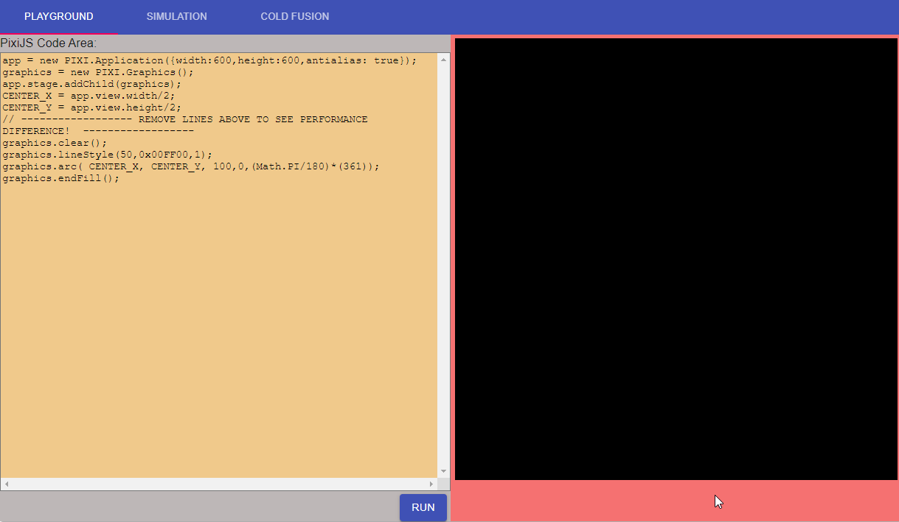

# pixijs-canvas-radar

A webpage serves as a test and demo to showcase the execution of code at runtime using PixiJS versus canvas methods and to demonstrate the duration of the drawings.

### URL: [https://aknbb.github.io/pixijs-canvas-radar/](https://aknbb.github.io/pixijs-canvas-radar/)

### Demo

#### Contact
Feel free to explore my pixijs-canvas-radar project and get in touch if you have any questions or collaboration ideas. You can reach out to me via [akinbuyukbulut@gmail.com](mailto:akinbuyukbulut@gmail.com) or connect with me on [LinkedIn](https://www.linkedin.com/in/akinbuyukbulut/) and [GitHub](https://github.com/Aknbb).
